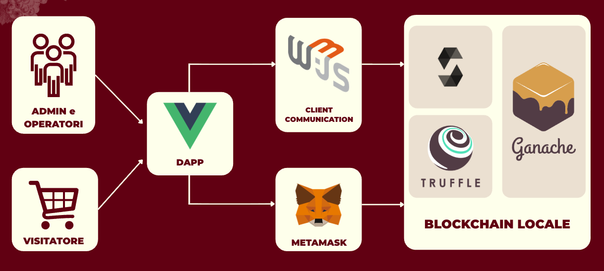
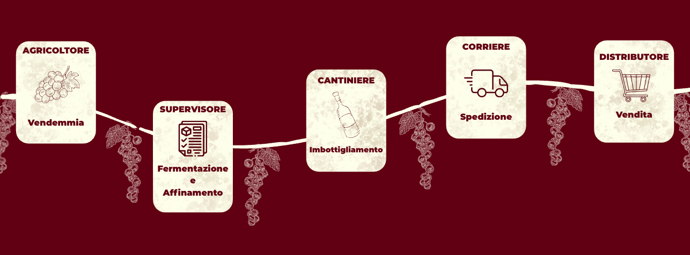
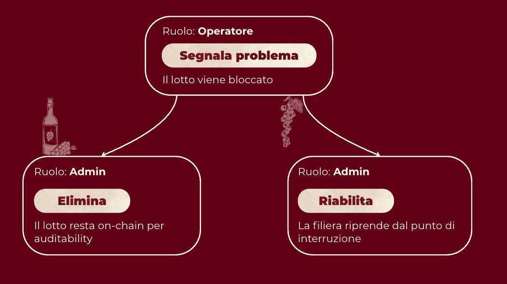
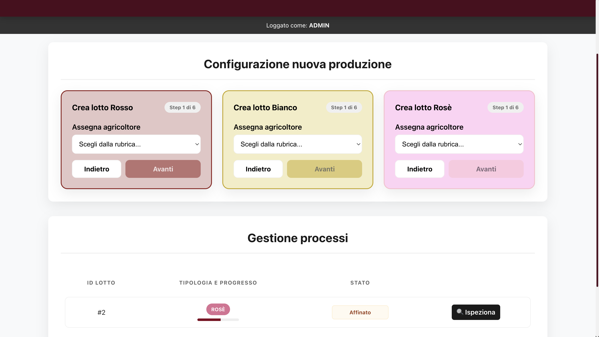
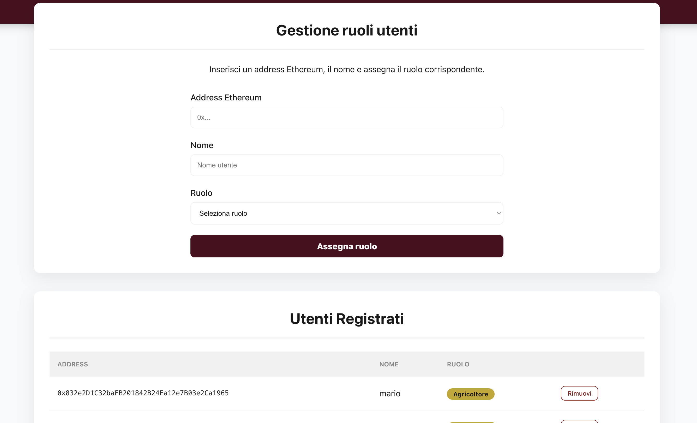
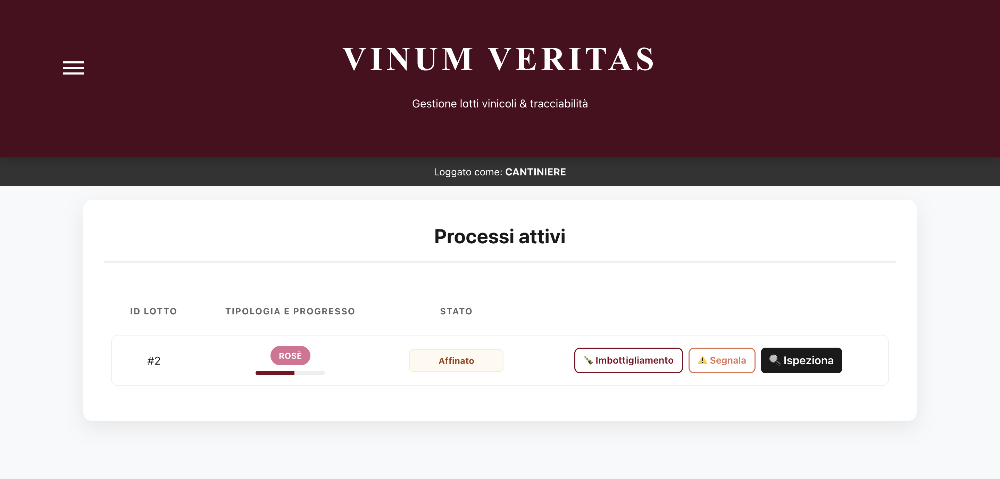
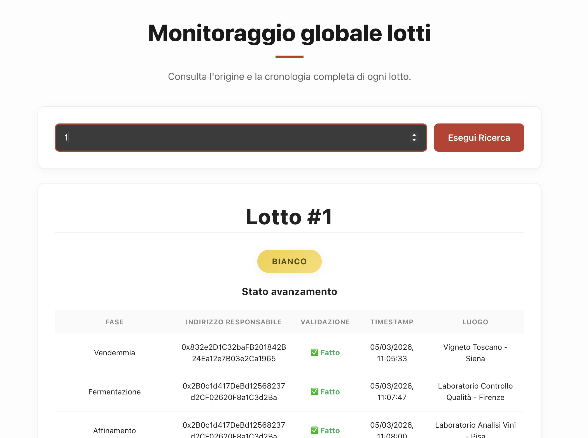

# Vinum Veritas

> Progetto per il corso di Blockchain and Cryptocurrencies   
> **Leonardo Vorabbi · Jacopo Bonifazi · Gaetano Muscarello** — A.A. 2025/2026

Vinum Veritas è una applicazione decentralizzata per la tracciabilità e certificazione della filiera vitivinicola su blockchain Ethereum. Ogni fase della produzione, dalla vendemmia alla distribuzione, viene registrata on-chain in modo immutabile, firmata crittograficamente dall'attore responsabile e verificabile da chiunque.

---

## Architettura

Il sistema è strutturato su tre livelli con responsabilità separate:



**Admin e Operatori** interagiscono con la dApp firmando transazioni tramite MetaMask. Ogni azione modifica lo stato on-chain.

**Il Visitatore** accede in sola lettura: interroga direttamente lo Smart Contract e legge la storia e l'autenticità del lotto senza necessità di un wallet.

---

## Stack tecnologico

| Layer | Tecnologia |
|---|---|
| Smart Contract | Solidity ^0.8.0 |
| Rete locale | Ganache |
| Deploy | Truffle |
| Comunicazione | Web3.js |
| Firma | MetaMask |
| Frontend | Vue.js |

---

## Ruoli utente

Il sistema distingue tre tipologie di accesso:

**Admin**
- Inizializza i processi creando nuovi lotti
- Assegna gli operatori
- Supervisiona la catena, gestisce revisioni ed eliminazioni

**Operatori**
- Eseguono le transazioni per far avanzare il lotto nella filiera
- Firmano crittograficamente ogni passaggio tramite MetaMask

**Visitatore**
- Accesso libero, nessun wallet richiesto
- Legge la storia e l'autenticità di un lotto

---

## Flusso della filiera

L'admin crea un lotto assegnando i vari operatori ad ogni fase. Successivamente ogni lotto passerà per la seguente filiera:



Percorso alternativo in qualsiasi fase attiva:



---

## Requisiti

- [Node.js](https://nodejs.org/) 
- [npm](https://www.npmjs.com/)
- [Truffle](https://trufflesuite.com/) — `npm install -g truffle`
- [Ganache](https://trufflesuite.com/ganache/) (versione desktop o CLI)
- [MetaMask](https://metamask.io/) come estensione del browser

---

## Installazione e avvio

### 1. Clona la repository

```bash
git clone https://github.com/leovora/vinum-veritas.git
cd vinum-veritas
```

### 2. Avvia Ganache

Apri Ganache desktop e crea un nuovo workspace, oppure avvia la versione CLI:

```bash
ganache --port 7545
```

Assicurati che la rete sia configurata su `HTTP://127.0.0.1:7545` con chain ID `1337`.

### 3. Compila e deploya il contratto

```bash
cd backend
truffle compile
truffle migrate --reset
```

### 4. Sincronizza gli ABI con il frontend

Dopo ogni compilazione o re-deploy, esegui lo script di sincronizzazione per copiare automaticamente gli ABI generati da Truffle nella directory del frontend:

```bash
node sync-abis.cjs
```

Questo passaggio è necessario ogni volta che il contratto viene ricompilato. Senza di esso il frontend userebbe una versione obsoleta dell'ABI e le chiamate Web3 potrebbero fallire silenziosamente.

### 4. Configura MetaMask

- Aggiungi una rete personalizzata con RPC `http://127.0.0.1:7545` e chain ID `1337`
- Importa uno degli account generati da Ganache usando la chiave privata mostrata nell'interfaccia
- Il primo account è automaticamente l'Admin (deployer del contratto)

### 5. Avvia il frontend

```bash
cd frontend
npm install
npm run dev
```

L'applicazione sarà disponibile su `http://localhost:5173`.


## Screenshot

> *Schermata Admin — gestione lotti*



> *Schermata Admin — gestione utenti*



> *Vista operatore — avanzamento stato lotto*



> *Vista visitatore — storico eventi e autenticità lotto*

